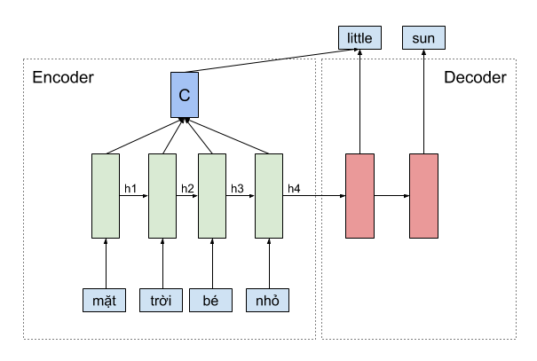

# Tìm hiểu và áp dụng cơ chế attention trong deep learning
## Giới Thiệu
Ở git này, mình cung cấp cho các bạn cài đặt chi tiết của cơ chế attention trong bài toàn seq2seq đã được đơn giản hóa. Đồng thời giải nghĩa kết quả tại mỗi thời điểm thông qua cơ chế này. Git này để phục vụ cho blog về attention mà mình đã viết, các bạn có thể đọc thêm tại [đây](https://pbcquoc.github.io/attention/) nhé.
## Tổng quan cơ chế attention trong deep learning
Cơ chế attention chỉ đơn giản là trung bình có trọng số của những “thứ” mà chúng ta nghĩ nó cần thiết cho bài toán, điều đặc biệt là trọng số này do mô hình tự học được. Cụ thể, trong bài toán dịch máy ở ví dụ dưới, khi sử dụng cơ chế attention để phát sinh từ little, mình sẽ cần tính một vector context C là trung bình có trọng số của vector biểu diễn các từ mặt, trời, bé, nhỏ tương ứng với vector h1,h2,h3,h4, rồi sử dụng thêm vector context c này tại lúc dự đoán từ little, và nhớ rằng, trọng số này là các số scalar, được mô hình tự học

[READ MORE](https://pbcquoc.github.io/attention/)

## Dataset
Để minh họa cơ chế attention, mình sử dụng tập dataset tự phát sinh, với đầu vào là các câu biểu diễn ngày tháng năm của con người đọc, và nhãn là ngày tháng năm tương ứng do máy tính hiểu. 

| Input                            | Label         |
| ---------------------------------| ------------- |
| 12, thg 9 2010                   | 2010-09-12    |
| Thứ Tư, ngày 21 tháng 3 năm 1973 | 1973-03-21    |
| 31 thg 7, 1988                   | 1988-07-31    |

Mình đã phát sinh tổng cộng 20k mẫu, trong đó 5k dùng để validation.

## Kết quả
Vì tập dữ liệu mình dùng để minh họa khá đơn giản, nên chỉ cần sau 3 epochs bạn đã có kết quả tương đối chính xác. Mình huấn luyện đến 10 epochs thì loss là 0.023 trên tập validation.

Dưới này là một minh họa của câu đầu vào là “05 thg 5 2017”, các bạn có thể thấy rằng các phần ngày tháng năm khi phát sinh đều được mô hình chú ý một cách đúng lúc và chính xác.

## Any Problems?
Nếu có bất kì câu hỏi gì, các bạn có thể liên hệ mình thông qua địa chỉ pbcquoc@gmail.com nhé !.
